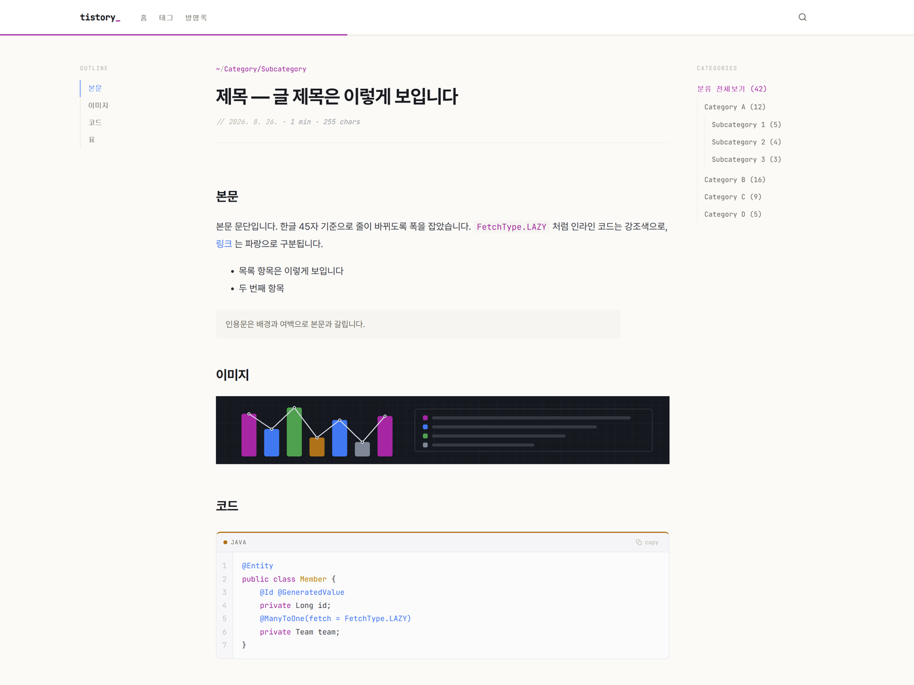
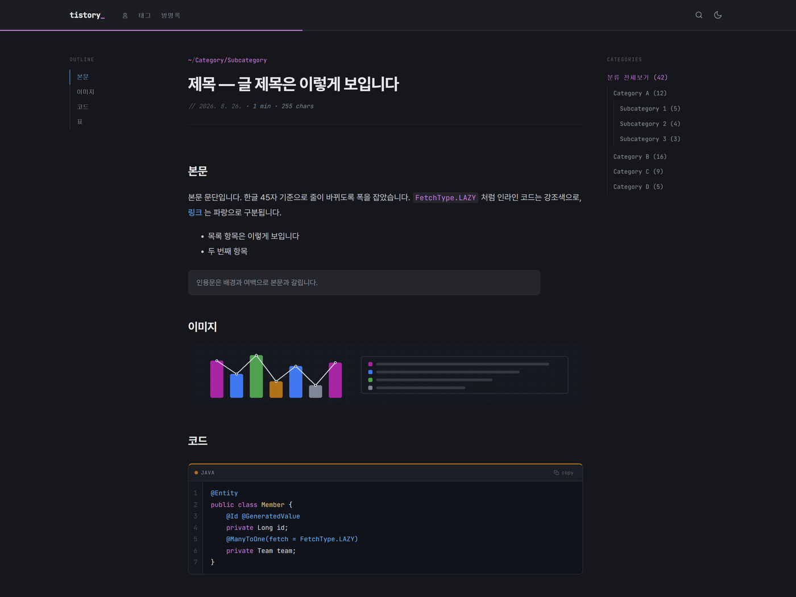

<div align="center">

# Gutter

**개발 블로그를 위한 티스토리 스킨**

코드 라인 넘버 거터 | 문법 강조 팔레트 | 다크모드 | 자동 목차 | 댓글·방명록

[](https://github.com/zziaho/tistory-gutter-skin/releases)
[](LICENSE)
[](https://www.tistory.com/)

</div>

| 라이트 | 다크 |
|:---:|:---:|
|  |  |

---

## Why Gutter?

개발 블로그의 본문은 절반이 코드입니다. 그런데 대부분의 티스토리 스킨은 코드블록을
회색 박스 하나로 처리합니다. 줄 번호가 없어 "12번째 줄 보세요"라고 쓸 수 없고,
있더라도 복사하면 번호가 같이 딸려옵니다.

**Gutter** 는 그 지점만 집요하게 봅니다. 줄 번호 거터를 `<pre>` 바깥의 독립
요소로 두어 복사에 섞이지 않게 하고, 문법 강조에 쓰는 색을 사이트 UI 색으로
승격해 글 전체가 에디터와 같은 색 규칙으로 읽히게 했습니다.

IDE 크롬(탭바·파일트리·상태바)은 일부러 그리지 않습니다. 흉내로 읽히는 데다
모바일에서 전부 버려야 해서 데스크톱과 인상이 갈리기 때문입니다.

---

## Features

### 코드

| 기능 | 설명 |
|------|------|
| **라인 넘버 거터** | `<pre>` 바깥의 독립 요소. 복사할 때 번호가 딸려오지 않고, 가로 스크롤 시 제자리에 남습니다 |
| **언어 배지 + 색** | 상단에 언어명 표시. 좌측 테두리 색은 GitHub 언어 색 관례를 따라 23개 언어 지정 |
| **코드 복사 버튼** | 원클릭 복사. 성공 시 버튼 라벨이 바뀝니다 |
| **에디터 언어 인식** | 기본 에디터는 언어를 `<pre>` 에, 마크다운 모드는 `<code class="language-*">` 에 넣습니다. 양쪽을 모두 읽어 `<code>` 로 옮기고 별칭 17개를 정규화합니다 |
| **평문 블록 구분** | 언어가 없는 블록은 배지·복사·거터를 달지 않습니다. 콘솔 출력이나 로그를 붙여넣은 자리이지 소스가 아니기 때문입니다 |
| **자동 감지 안 함** | 언어가 지정된 블록만 색을 입힙니다. 자동 감지는 평문에 엉뚱한 키워드 색을 칠합니다 |
| **필요할 때만 로드** | highlight.js 를 `<head>` 에 걸어두지 않습니다. 코드블록을 찾은 뒤에만, 그 글에 실제로 쓰인 언어만 내려받습니다. 홈·목록·카테고리·검색·방명록은 코어를 아예 받지 않습니다 |

### 에디터 두 방식 모두 지원

티스토리는 기본 에디터와 마크다운 모드로 글을 쓸 수 있고, 같은 글이라도 서로 다른
HTML 로 나옵니다. 어느 쪽으로 써도 같은 모양이 되도록 맞춰뒀습니다.

| 항목 | 설명 |
|------|------|
| **문단 여백** | 기본 에디터는 빈 `<p>` 로 간격을 만들고, 마크다운 모드는 문단당 `<p>` 하나만 씁니다. `data-ke-size` 유무로 갈라 마크다운 글에만 여백을 되돌립니다. 기본 에디터 글의 간격이 두 배로 벌어지지 않습니다 |
| **인용문** | 에디터 인용문에는 `data-ke-style` 이 붙고 티스토리가 가운데 정렬과 따옴표 배경 이미지를 먹입니다. 선택자 특이성을 올려 되돌리므로 마크다운 인용문과 같은 모양이 됩니다 |

코드블록 언어도 양쪽을 다 읽습니다 (위 '에디터 언어 인식').

### 읽기

| 기능 | 설명 |
|------|------|
| **자동 목차** | H2/H3 기반. IntersectionObserver 스크롤 스파이로 현재 섹션 하이라이팅 |
| **다크모드** | OS 설정 자동 감지 + 수동 토글 + `localStorage` 저장. 렌더 전 인라인 스크립트로 FOUC 방지 |
| **읽기 진행률 바** | 헤더 하단에 스크롤 진행도 표시 |
| **읽는 시간 · 글자수** | 한국어 기술 문서 기준 분당 500자로 계산 |
| **헤딩 앵커** | 제목에 `#` 링크 자동 삽입 |
| **이미지 라이트박스** | 본문 이미지 클릭 시 전체화면 |
| **표 가로 스크롤** | 넓은 표를 스크롤 래퍼로 감쌉니다. 테이블 레이아웃은 그대로 유지됩니다 |
| **댓글 · 방명록** | 티스토리 기본 치환자 사용. 플랫폼이 기능을 추가하면 스킨 수정 없이 따라옵니다 |
| **색 대비 AA** | 본문·메타·문법 강조 토큰 전부 배경 대비 4.5:1 이상. 라이트·다크 양쪽에서 검증했습니다 |
| **렌더를 막지 않는 폰트** | 두 폰트 스타일시트를 `preload` 로 받아 첫 페인트를 막지 않습니다. JS 가 꺼져 있으면 `noscript` 사본이 받습니다 |

### 개발자 취향

| 기능 | 설명 |
|------|------|
| **경로형 브레드크럼** | 카테고리를 경로처럼 표기. 하단 이동 링크는 `cd ../` |
| **모노스페이스 메타** | 날짜·카테고리·태그 등 메타 정보 전체가 고정폭. 주석 스타일 날짜 표기 |
| **카테고리 글 수** | `(12 files)` 형태로 표시. 글 상세에는 이 치환자가 없어 카테고리 트리 출력에서 읽어옵니다 |
| **검색 단축키** | `Ctrl`/`Cmd` + `K` 또는 `/` 로 검색 오버레이, `Esc` 로 닫기 |
| **구조화 데이터 보강** | 플랫폼이 `BlogPosting` 만 넣어주므로 `WebSite`(작성자 귀속)와 `BreadcrumbList` 를 추가합니다 |

---

## Install

> **전체 절차는 [설정 · 커스터마이징 안내](docs/SETUP.md) 에 있습니다.**
> 스킨 옵션 12개 설명, CSS 토큰 표, 문제 해결까지 그쪽이 정본입니다.
> 아래는 요약입니다.

**1. 내려받기**

[Releases](https://github.com/zziaho/tistory-gutter-skin/releases) 에서 받거나:

```bash
git clone https://github.com/zziaho/tistory-gutter-skin.git
```

**2. 올리기** — `블로그 관리 > 꾸미기 > 스킨 등록`

| 파일 | 올릴 위치 |
|------|-----------|
| `index.xml`, `skin.html`, `style.css` | 루트 |
| `preview.gif`, `preview256.jpg`, `preview560.jpg`, `preview1600.jpg` | 루트 |
| `images/script.js` | **`images/` 아래** |

`script.js` 의 경로가 중요합니다. `skin.html` 이 `./images/script.js` 로
참조하고, 티스토리는 필수 3개 파일 외에는 `images/` 아래만 받습니다.

**3. 티스토리 관리자 설정** — 스킨 파일만 올려서는 부족합니다

| 설정 | 안 하면 |
|------|---------|
| `꾸미기 > 모바일` 의 **모바일 웹 자동 연결 끄기** | **모바일 방문자가 이 스킨을 아예 보지 못합니다.** 티스토리 기본 모바일 스킨이 뜹니다 |
| `메뉴 > 카테고리 관리` 를 **리스트형**으로 | 카테고리가 `table`+`gif` 로 나와 스타일도 크롤링도 안 됩니다 |

Gutter 는 PC 스킨 하나로 모바일까지 처리하는 반응형입니다. 별도 모바일 스킨이
필요하지 않습니다.

**4. 광고 (선택)** — 게시자 ID 는 하드코딩되어 있지 않습니다. 스킨 설정에서
`애드센스 게시자 ID` 와 슬롯 ID 를 채우면 켜지고, 비워두면 스크립트 자체가
출력되지 않습니다. 본문 위·아래 두 자리를 따로 켤 수 있습니다.

---

## Customize

HTML·CSS 를 고치지 않고 **스킨 옵션 12개**로 조정합니다. 색 2개, 표시 5개,
구조화 데이터 2개, 광고 3개입니다.
→ [옵션 전체 설명](docs/SETUP.md#3-스킨-옵션)

그 이상은 `style.css` 맨 위 `:root` 의 **CSS 커스텀 프로퍼티**를 고칩니다.
표면·글자·문법 강조 색과 `--radius`, `--measure`, 글꼴이 여기 모여 있습니다.
→ [토큰 표](docs/SETUP.md#6-색-바꾸기)

### 색을 바꿀 때

기본 색은 Atom One Light 계열입니다. 카테고리는 keyword 보라, 링크는 function
파랑, 메타 정보는 comment 회색을 씁니다. 원색 그대로가 아니라 본문·코드 배경
어디에서도 **대비 4.5:1(WCAG AA)을 넘도록 명도를 낮춰** 잡은 값입니다.
편집기 테마 색은 흰 배경 대비를 기준으로 고른 것이 아니어서 그대로 쓰면
회색·노랑 계열이 기준에 걸립니다.

두 가지는 의도적으로 옵션을 따르지 않습니다.

- **코드블록 안의 색** — 사이트 색을 문법 팔레트에서 가져오는 방향이지 그
  반대가 아닙니다. 옵션을 밝은 색으로 바꿨을 때 코드가 안 읽히는 일을 막습니다.
- **다크모드** — 라이트 배경 기준으로 고른 색이 어두운 배경에서 대비가
  무너지는 일이 잦아 별도 팔레트를 씁니다.

---

## How it works

```
skin/
├── index.xml          # 스킨 정보 + 스킨 옵션 12개
├── skin.html          # 전 페이지 공용 템플릿
├── style.css          # 전체 스타일시트 (CSS 커스텀 프로퍼티)
├── preview.gif        # 112x84    관리자 화면 폴백
├── preview256.jpg     # 256x192   적용 중인 스킨 표시
├── preview560.jpg     # 560x420   스킨 목록 카드
├── preview1600.jpg    # 1600x1200 스킨 상세
└── images/
    └── script.js      # 메인 JavaScript (12개 모듈)
```

`preview*` 는 티스토리 관리자 화면에서만 쓰입니다. 블로그 방문자에게는 보이지
않고, 파일명과 크기가 플랫폼 규약으로 고정되어 있습니다.

**`skin.html` 하나가** 홈·목록·글·카테고리·검색·태그·방명록을 전부 렌더링합니다.
페이지 종류별로 파일이 나뉘지 않고, URL 에 따라 그룹 치환자 블록이 켜지고 꺼집니다.

### 레이아웃 판별

`<html>` 의 클래스 두 개로 갈립니다. 둘 다 퍼머링크 블록 안의 인라인 스크립트가
붙이므로 첫 페인트 전에 결정됩니다.

| 클래스 | 붙는 시점 | 결과 |
|--------|-----------|------|
| `is-post` | 퍼머링크 블록 진입 시 | 글 상세로 판별 |
| `has-toc` | 본문 직후, 제목 2개 이상일 때 | 목차 레일 추가 |

### `h1` 은 어느 페이지에서도 하나

목록 머리말 `h1` 은 페이지 종류와 무관하게 출력되고, 자체 `h1` 을 이미 가진
페이지에서만 CSS 가 숨깁니다. 판별은 `[##_body_id_##]` 가 채우는 `<body id>` 로
합니다.

| `body id` | 페이지 | 머리말 h1 |
|---|---|---|
| `tt-body-index` / `-category` / `-search` / `-archive` | 목록 | 표시 |
| `tt-body-page` | 글 · 페이지 · 보호글 | 숨김 (글 제목이 h1) |
| `tt-body-guestbook` / `-tag` | 방명록 · 태그 | 숨김 (자체 h1 있음) |

### 반응형 3단계

| 폭 | 달라지는 것 |
|---|---|
| 1180px 이하 | 우측 카테고리 숨김. 목차는 200px 사이드바로 유지 |
| 900px 이하 | 1단. 목차가 본문 위 접이식 상자로, **접힌 상태로 시작** |
| 768px 이하 | 모바일 여백. 코드블록이 화면 폭 끝까지 |

---

## Tech Stack

| 항목 | 선택 | 이유 |
|------|------|------|
| CSS | 커스텀 프로퍼티 | 빌드 없이 다크모드 테마 전환 |
| JS | Vanilla ES5 (IIFE) | 의존성 0, 빌드 불필요 |
| 레이아웃 | CSS Grid | 목차 유무에 따른 칼럼 전환을 정의 한 줄로 처리 |
| 폰트 | Pretendard + JetBrains Mono | 한국어 본문 최적화 + 코드·메타용 고정폭. 가변 + 동적 서브셋, 렌더 비차단 |
| 코드 | highlight.js CDN (지연 로딩) | 코드블록이 있는 글에서만, 실제로 쓰인 언어만 |

---

## Known Limitations

- **highlight.js CDN 의존.** cdnjs 장애 시 코드블록이 무채색으로 떨어집니다.

- **광고 미충전 시 레이아웃 이동(CLS).** 광고 자리는 CSS 로 크기를 잡아 두지만,
  애드센스는 채워지지 않은 유닛(`data-ad-status="unfilled"`)에 `display:none` 을
  겁니다. 그 순간 잡아 둔 크기가 무의미해져 자리가 0 이 되고 아래 내용이 위로
  올라옵니다. 실측(2026-08-31)에서 이 이동이 데스크톱 CLS 0.075,
  모바일 0.166 의 대부분이었습니다.

  바깥 래퍼에 `min-height` 를 걸어 자리를 붙잡는 방법을 시도했지만, 이동이
  줄기는커녕 늘었고(모바일 0.166 → 0.326) 광고가 없을 때 빈 칸이 남는 대가만
  확실해 채택하지 않았습니다. 본문 블록 자체가 늦게 나타나는 별도 원인이 있는데
  이건 티스토리가 `.post-content` 에 인라인 높이를 넣는 쪽이라 스킨에서 손댈 수
  없습니다.

- **검증 범위.** 1.0.0 은 블로그 한 곳에서 검증했습니다. 다른 블로그의 글
  마크업·플러그인·카테고리 구조에서 겹치는 문제가 있을 수 있습니다. 발견하시면
  Issues 로 알려주세요.

---

## Contributing

**문제를 발견하면 [Issues](https://github.com/zziaho/tistory-gutter-skin/issues) 에 올려주세요.**
직접 쓰다 막힌 지점이 가장 값어치 있는 제보입니다.

버그 제보에 아래가 함께 있으면 원인을 훨씬 빨리 좁힐 수 있습니다.

- 문제가 보이는 **글 주소** (재현되는 페이지가 있으면 결정적입니다)
- 브라우저와 기기 (예: Chrome 141 / Windows, Safari / iPhone)
- 스킨 옵션에서 바꾼 값
- 라이트 / 다크 중 어느 쪽에서 나는지
- 스크린샷

티스토리 스킨은 페이지 종류마다 다른 치환자 블록이 켜지고 꺼집니다. 그래서
"어느 페이지인지"가 원인 절반을 알려줍니다. 목록·글·카테고리·검색·태그·방명록
중 어디였는지 적어주시면 좋습니다.

기능 제안, 다른 블로그에서 겹치는 스타일 충돌, 문서에서 틀린 서술도 환영합니다.

Pull Request 도 받습니다. 빌드 과정이 없어서 `skin/` 아래 파일을 직접 고치면
그대로 동작하고, 확인은 `관리 > 꾸미기 > 스킨 등록` 으로 올려 실제 블로그에서
합니다.

---

## Credits

- [highlight.js](https://github.com/highlightjs/highlight.js) — BSD-3-Clause
- [Pretendard](https://github.com/orioncactus/pretendard) — SIL Open Font License 1.1
- [JetBrains Mono](https://www.jetbrains.com/lp/mono/) — SIL Open Font License 1.1

세 프로젝트 모두 CDN 으로 불러오며 저장소에 포함하지 않습니다.
기본 팔레트는 Atom One Light 의 색값을 참고했을 뿐, 코드를 가져오지 않았습니다.

## License

[MIT](LICENSE) — 개인 블로그든 상업 프로젝트든 제약 없이 쓸 수 있습니다.
수정해서 재배포해도 되고, 출처를 밝히지 않아도 됩니다.

조건은 하나입니다. 사본과 파생물에 저작권 표시와 라이선스 전문을 남겨주세요.
저장소의 `LICENSE` 파일과 `skin/index.xml` 의 `<license>` 항목이 그 역할을 하므로,
그 두 개를 지우지 않으면 됩니다.
